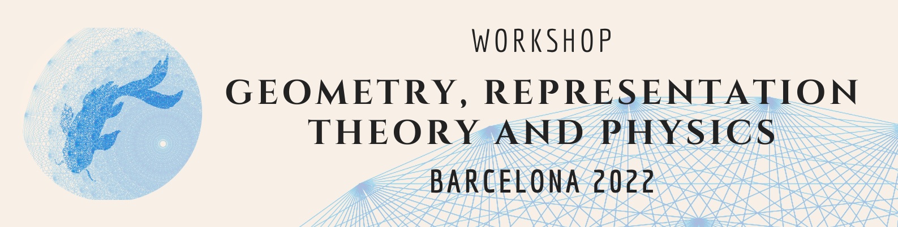
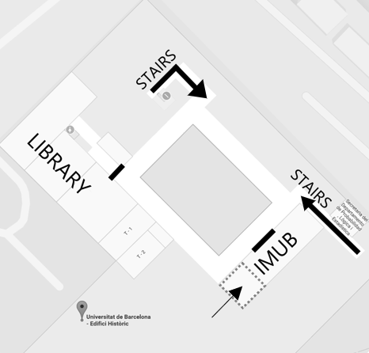
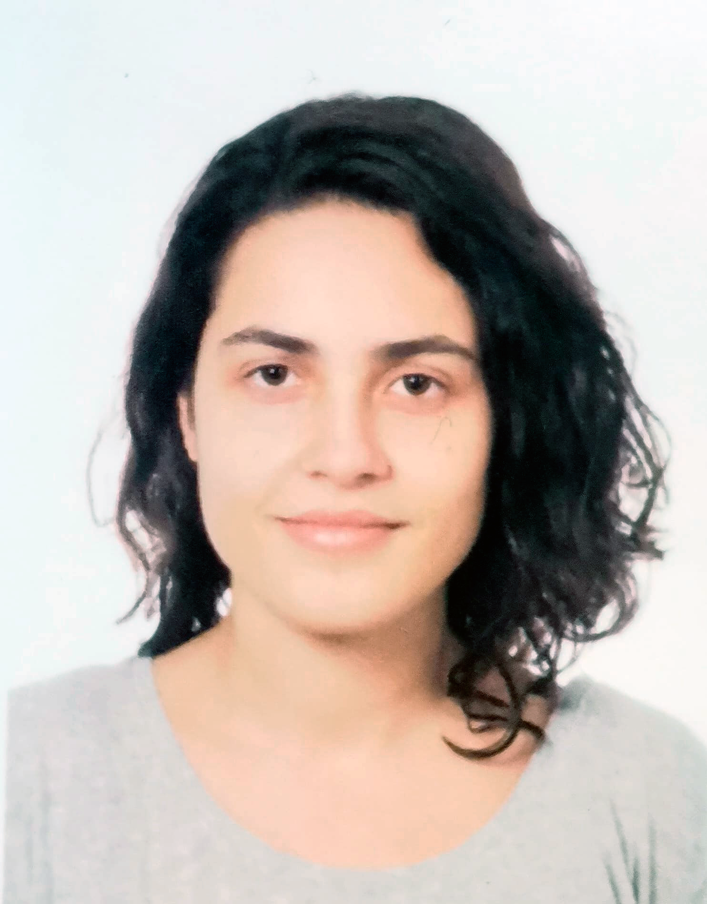
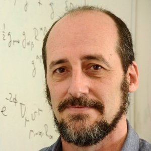

[Site under construction]

<!---
# Geometry, Representation Theory and Physics Workshop - Barcelona 2022
-->

This workshop is meant to give a formal introduction to relevant topics in geometry, representation theory and its applications to physics. In this Workshop, young researcher in these domains will give 3 to 4 hour long lectures during the last week of July 2022. In between lectures, there will be special speakers that will talk about more specific subjects like the geometry of AdS or classification problems in Algebraic Geometry. 

This free-to-enter workshop is targeted towards young researchers in mathematics, mathematical physics or theoretical physics but can be attended by anyone interested on theses domain.

## Index
1. [Planning](#planning)
2. [Attending the workshop](#attending-the-workshop)
3. [Lecturers and Abstracts](#lecturers-and-abstracts)
4. [List of Participants](#list-of-participants)
5. [Organizing team](#organizing-team)

## Planning
The workshop will be taking place from the 25th to the 29th of July, from 9h00 to 13h00 and from 15h00 to 18h00 (GTM+2).

In the next weeks a specific planning will be updated. 

|Hours | Mon 25th | Thu 26th | Wed 27th | Thu 28th | Fri 29th | 
|:---:|:---:|:---:|:---:|:---:|:---:|
|9h00-10h00 |  | |  | |  | |  | |  | 
|10h00-11h00 | | Roberto Emparan|  | |  | |  | |  | 
|11h20-12h20 |  |  |  | |  | |  | |  | 
|12h20-13h20 |  |  |  | |  | |  | |  | 
|15h00-16h00 |  | |  | |  | |  | |  | 
|16h00-17h00 | | |  | |  | |  | |  | 
|17h00-18h00 |  |  |  | |  | |  | |  | 

<!---

-->

## Attending the workshop

If you are planning to attend the workshop from outside barcelona please contact in advance at GRPWorkshop2022@outlook.com filling the following information:

- **Name**:

- **University or Institution**: (if any)

- **Position**: (Student, Ph.D, Professor...)

- **Domain of Interest**: 

This workshop will take place in the IMUB room.

Second Floor, Faculty of Mathematics.

Gran Via de les Corts Catalanes, 585

08007 Barcelona

## Lecturers and Abstracts

**List of Speakers.**
- Roberto Emparan - [Geometrical Aspects in AdS/CFT](#roberto-emparan._geometrical-aspects-in-ads/cft_)

### Ismaël Lahlali Ahlouche. _Kirillov’s orbit method_

Ismaël L.Ahlouche is a last year master student in physics at the University of Mons. His master thesis was about the geometry of coadjoint orbit and their quantization. Some of his interests are in  Poisson geometry, representation theory and quantization of classical systems. During his talk he will give a short introduction to the orbit method. The latter due to Kirillov, is a method to construct unitary irreducible representations (UIR) of a given Lie group from a geometrical object that we call  coadjoints orbits. In the first part he will explain what is a coadjoint orbit and how do we construct UIR from it, while the last part focus on some examples.

### Ivano Basile. _String theory and representation_

Ivano Basile obtained his PhD at Scuola Normale Superiore, Pisa, under the supervision of Augusto Sagnotti. He worked on supersymmetry breaking in string theory. Currently he is a postdoctoral researcher at UMONS, and will join the string theory group at LMU and Max Planck Institute in Munich in the fall. His academic interest string theory, holography, swampland program.

The plan  of this talk is to introduce strings in flat spacetime, focusing on the representation theory of the free spectrum.
The consistency conditions on these spectra are reflected in the remarkable modular properties of the corresponding partition functions, and lead to just a handful of possible consistent models, among which the celebrated superstrings in ten dimensions.

### Thomas Basile. _Introduction to deformation quantization of Poisson manifolds_
Thomas Basile is starting his secod PostDoc on Higher spin Gravity at the University of Mons. His interests include algebraic aspects of higher spin gravity, deformation quantization, and its relation to topological sigma models. The  lectures  that he will provide is about deformation quantizaton of Poisson maniolds. The latter consists in deforming the structure of associative algebra of the algebra of functions on a Poisson manifold.  He will also discuss  the so-called formality theorem. More precisely, we will discuss the precise content of the formality theorem, and explain how it implies the existence of a deformation quantization for all Poisson manifolds.

### Anna Blanco Cabanillas. _Topics p-adic representation theory_

She graduated with a double Bachelor’s in mathematics and physics at the University of Barcelona last February. Her interests are p-adic representations of Galois groups, algebraic methods in number theory, and applications of Langland's program in physics. She will introduce p-adic representation theory. 

### Roberto Emparan. _Geometrical Aspects in AdS/CFT_
[ICREA Webpage](https://www.icrea.cat/Web/ScientificStaff/roberto-emparan-garcia-de-salazar-226)

<!---

img src="drawing.jpg" alt="drawing" width="200"/>
)
-->

Roberto Emparan is ICREA research professor at the Institute of Cosmos Sciences of the University of Barcelona since 2003. He received his PhD from the University of the Basque Country in 1995, and then held postdoctoral positions at UC Santa Barbara, Durham University, and CERN. His research lies at the interface between General Relativity and String Theory, focusing on the classical, quantum, and stringy properties of black holes in different numbers of dimensions, subjects on which he has authored more than 120 articles. In 2016 he received an Advanced Grant of the European Research Council. In 2022 he has been elected Fellow the International Society of General Relativity and Gravitation. He is a member of the editorial board of Living Reviews in Relativity, Journal of High Energy Physics, and Advances in Theoretical and Mathematical Physics. In his talk he will describe some of the geometric features that underlie the AdS/CFT correspondence, which provides a holographic quantum theory of gravity. 

### Josh'O'Connor. _Affine algebra & Kaco moody_
Josh O’Connor is a PhD student of theoretical physics at the University of Mons in Belgium. His previous studies focused on pure mathematics and, later, theoretical physics. Some of his interests include Kac-Moody algebras, dualisation, mixed-symmetry fields and algebraic structure in physics. He will provide lectures which will focus on the elementary structure theory of Lie algebras and, more generally, Kac-Moody algebras. Also,  Some relationships between physics and these algebras will be discussed. 

<!---
- [Lien 1](https://github.com/Seminael/Seminael.github.io/blob/main/pdf-support/JeuAliceEtBob.pdf)
- [Lien 2](http://))
-->

### David Mateos. _Dynamical aspects in AdS/CFT_
Finished a Ph.D. in Spacetime physics from worldvolume branes at the University of Barcelona back in 2000 and is now an ICREA Research Professor at the Department of Quantum Physics and Astrophysics, ICCUB, at the University of Barcelona. His research interests center around the classical and quantum physics of Black Holes and gauge/string duality and quantum chromodynamics. In his talk, he will talk about…

### Ignasi Mundet 

### Juan Carlos Naranjo 

### Simon Pekar. _Introduction to Higher spin theory_
Simon Pekar is a PhD student at University of Mons. His academic interest consists in algebra,  geometry, asymptotic symmetries, holography, higher-spin theories and Carrollian physics.  During the lectures we will discuss the symmetries of higher-spin gravity theories, which are classical theories of gravity, including gauge fields with spin strictly greater than two.
In particular, we  will take a look at higher-spin diffeomorphisms that are gauge transformations of those fields. 
After a review of higher-spin theories and the representation of their algebra of infinitesimal gauge transformations, we discuss in details  the obstructions to the lift of these representations to those of a group. We also explain how to bypass this problem by elaborating on results from symplectic geometry and deformation quantization.

### Mattia Serrani. _Higher Spin algebras_
Mattia Serrani obtained his Master in Theoretical Physics at the University of Pisa in December 2020. Now he is a PhD Student at University of Mons. His interest are both in pure math and physics, precisely in Higher spin gravity, Higher spin algebras, Gauge theories, Constrained Hamiltonian Systems, AdS/CFT  and  Geometry. This talk is meant to create a bridge between math and physics regarding the study of higher spin  algebras. First, I will try to give some Physical motivation for the interest on these algebras. Secondly, we will try to define this algebras in various dimensions (with particular attention to the 3d and 4d cases) and to interpret them physically as global symmetries or gauge symmetry in one dimension more. Lastly, we will see some ways to explicitly construct them and I will give some examples.

### Tung Tran. _Deformation of complex structures_
Tung Tran his currently a PostDoc in theoretical physics at the University of Mons in Belgium. His academic interst is mainly about Higher-spin theories, twistor theory, and deformation theory.
In his talk, we will study the deformation of complex structures on complex manifolds based on the Spencer-Kodaira theory, which has significant applications in twistor theory. In particular, we will show how the deformation of twistor geometry can lead to various self-dual theories on spacetime via the Penrose transform.

### Artur Vieiro _ _

<!---
- [Lien 1](https://github.com/Seminael/Seminael.github.io/blob/main/pdf-support/JeuAliceEtBob.pdf)
- [Lien 2](http://)
-->

## List of Participants

|Adrien Scalea | University of Mons | 
|Ismaël Ahlouche |University of Mons|
|Noémie Parrini | University of Mons| 
| Thomas Carrière | University of Bordeaux | 
|Anna Blanco Cabanillas | University of Barcelona | 
| Vic | University of Gent  | 

## Organizing team

### Anna Blanco Cabanillas 

### Ismael L.Ahlouche
Ismaël L.Ahlouche is a last year master student in physics at the University of Mons.
